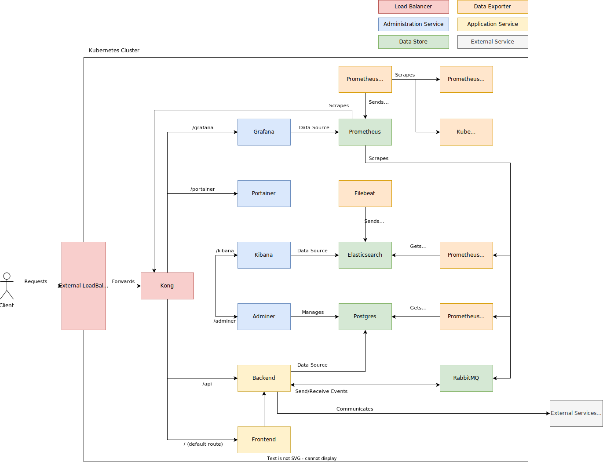

# DevOps Project (IDP Assignment)

Students:
- Ion David-Gabriel 343C1
- Damian Ștefania-Dorina 343C1

## Overview

The infrastructure is build using Terraform, which connects to GCP and sets up the Kubernetes Cluster. The actual Kubernetes deployments are done using Helm. The system can be accessed using an external load balancer, which forwards the request to an internal load balancer (Kong). This then forwards the requests depending on the requested path:

- /adminer
    - Adminer instance to manage postgres
- /grafana
    - To visualize metrics
- /kibana
    - To query and inspect logs
- /portainer
    - To handle the automatic deployments of the frontend and backend services
- /api
    - Forwards requests to the backend service
- / (default route)
    - Forwards requests to the frontend service

## Architecture

The services used in this system are:
- Kong
    - Sits behind the only entry point in the system, the external load balancer, and forwards requests to the exposed services. It also exposes prometheus metrics
- Portainer
    - Handles deployments of the frontend and backend services, published on GitHub. It automatically pulls the latest release by polling the `release-latest` tag
- Postgres
    - Database used by the application. Has the initial database created with the name `warproject`. The username is `admin` and the password is randomly generated. It is exposed internally at `postgresql:5432`
    - Metrics are exposed by a separate service, which is scraped by Prometheus
- Adminer
    - Management tool for Postgres. It is already setup to connect to the correct address and only requires the credentials
- ElasticSearch
    - Used for storing logs
    - Metrics are exposed by a separate service, which is scraped by Prometheus
- Filebeat
    - Exports the logs from the kubernetes pods and indexes them in ElasticSearch. They have a retention of 30 days
- Kibana
    - Management tool used for visualizing the logs stored in ElasticSearch
- Prometheus
    - Metrics timeseries database
    - There are also several deployments which export metrics from other services, Prometheus then scaping them (ElasticSearch, Postgres, general metrics from Kubernetes)
- Grafana
    - Service which allows the visualisation of the Prometheus metrics
    - Comes with several default dashboards
- RabbitMQ
    - Messaging queue

For Postgres, RabbitMQ and Elasticsearch, the authentication is done using the `admin` username. The passwords are randomly generated and can be accessed with
- `terraform output postgresql_password`
- `terraform output rabbitmq_password`
- `terraform output elasticsearch_password`

## CI/CD

For the CI/CD process, each of the Frontend and Backend GitHub repositories have two workflows attached:
- Lint and Test
    - Runs a linter for the project's language and runs the unit tests
    - This workflow runs for every push and pull request
- Build and Deploy
    - Builds the project's binaries
    - The binaries are copied into a Docker image in a private registry (Google Container Registry) ready to be deployed
    - A Kubernetes manifest is generated, which will be used to launch the created Docker image and create a service which exposes it
    - Triggers a webhook setup in Portainer, which runs the manifest and deploys the new version

## Possible improvements

- Host the Terraform state file on a proprietary machine, in a separate cluster
- Limit pod communication to only the necessary hosts, both for internal and external dependencies
- Apply authentication in the load balancer using a JWT, allowing only administrators to access anything other than the frontend and backend
